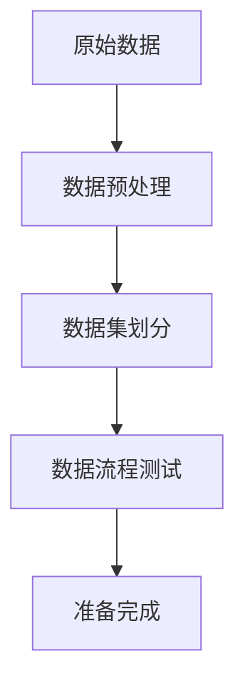
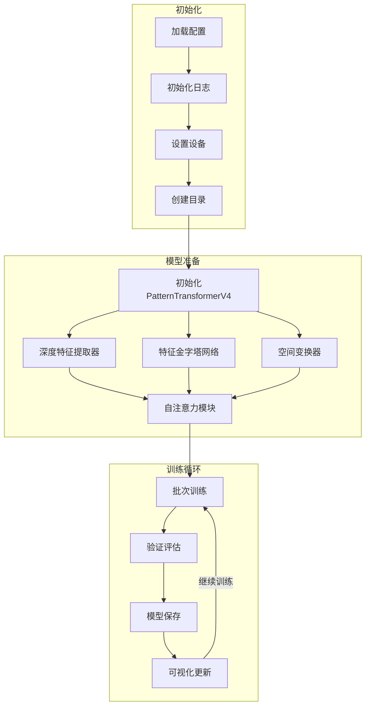
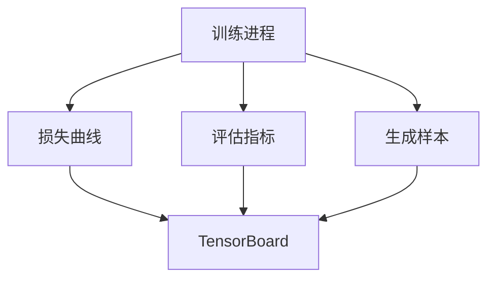
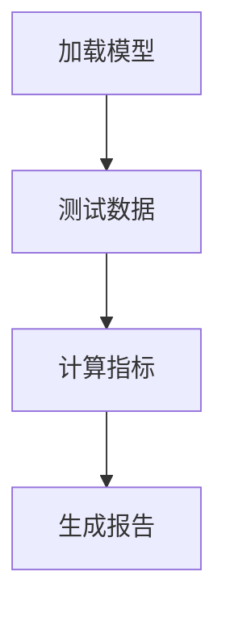

# 训练工作流程

## 1. 数据准备阶段

## 2. 模型训练阶段

## 3. 监控和可视化

## 4. 模型评估

## 关键配置说明

### 1. 训练参数
- batch_size: 1
- learning_rate: 0.0005
- epochs: 100
- early_stopping: enabled

### 2. 模型参数
- encoder: ResNet18
- feature_dim: 64
- transformer_heads: 4
- spatial_scales: 3

### 3. 优化策略
- optimizer: Adam
- scheduler: CosineAnnealingLR
- gradient_clip: 1.0

## 注意事项

1. 显存管理
- 单样本峰值内存约1.5GB
- 建议使用24GB以上显存的GPU
- 可开启混合精度训练

2. 检查点保存
- 每10个epoch保存一次
- 保留最新的2个检查点
- 单独保存最佳模型

3. 训练监控
- 实时查看训练日志
- 定期检查可视化结果
- 关注验证集性能